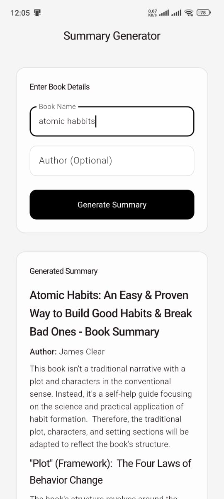
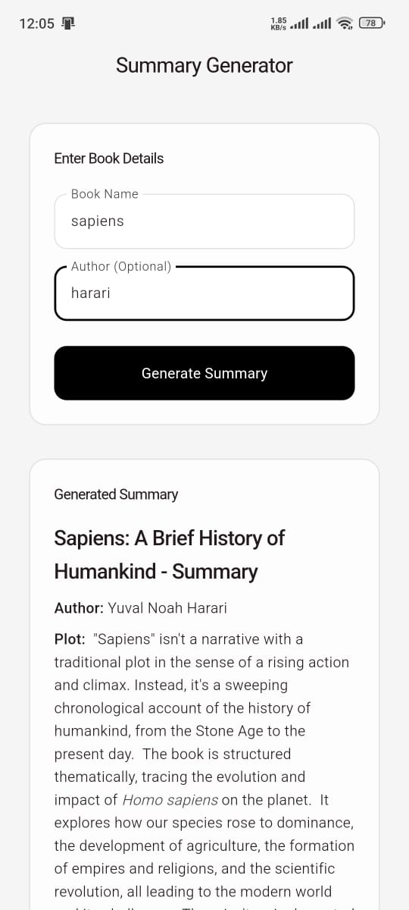

# 📚 Summary Generator App

 

Summary Generator is a simple and user-friendly Android app built using **Flutter**. It allows users to quickly generate book summaries by simply entering the **book name** and optionally the **author name**. The app uses the **Gemini API** to fetch a concise, high-quality summary of the book.

## ✨ Features

- 📖 Enter book title and author name (optional) 
- ⚡ Generate accurate and structured summaries instantly
- 🤖 Powered by **Gemini API** for natural language processing
- 🧼 Clean and minimal UI
- 📱 Optimized for Android devices

## 🚀 Getting Started

### Prerequisites

Make sure you have the following installed:
- [Flutter SDK](https://flutter.dev/docs/get-started/install)
- Android Studio or Visual Studio Code
- An active Gemini API key

### Installation

1. **Clone the repository:**
   ```bash
   git clone https://github.com/yourusername/summary-generator.git
   cd summary-generator
   ```

2. **Install dependencies:**
   ```bash
   flutter pub get
   ```

3. **Add your Gemini API Key:**
   Open the file where the Gemini API is initialized and replace with your API key.

4. **Run the app:**
   ```bash
   flutter run
   ```

## 🧠 How It Works

* The user enters the book name and optionally the author.
* On tapping **"Generate Summary"**, the app sends a request to Gemini's language model.
* The API returns a summary which is then displayed in a clean format on the screen.


## 🛠️ Built With

* **Flutter** – UI toolkit for building natively compiled apps
* **Dart** – Programming language
* **Gemini API** – LLM by Google for generating summaries

## 🙌 Acknowledgements

* [Flutter Documentation](https://flutter.dev)
* [Gemini API](https://ai.google.dev/)

## 📄 License

This project is licensed under the MIT License - see the [LICENSE](LICENSE) file for details.
